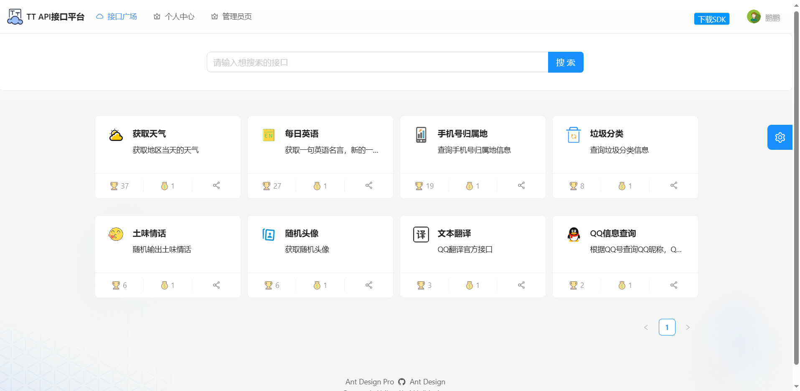
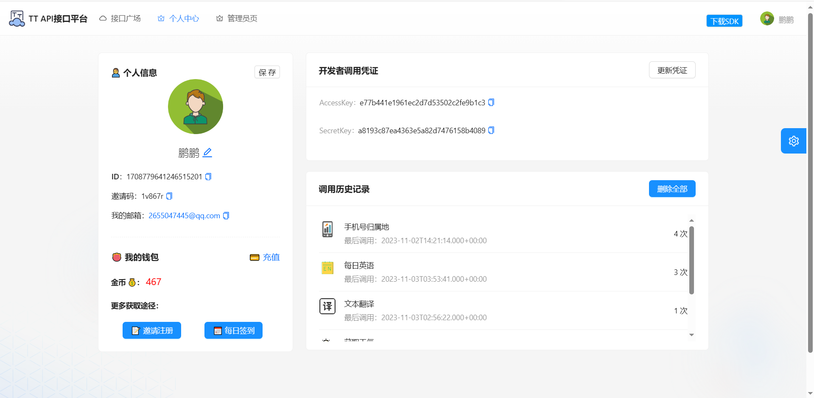
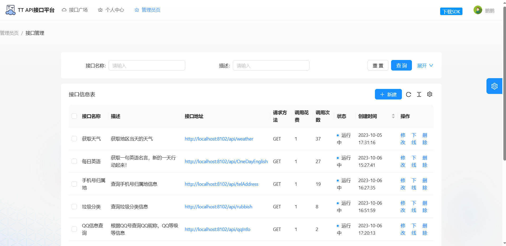

# API开放平台（后端）
## 项目架构

后端：[API-backend](https://github.com/pengpeng-git/api-backend)
前端： [API-frontend](https://github.com/pengpeng-git/api-frontend)
网关： [API-gateway](https://github.com/pengpeng-git/api-gateway)
接口SDK：[API-interface](https://github.com/pengpeng-git/api_interface)

## 技术选型

**前端**

- React 18
- Ant Design Pro 脚手架

**后端**

- Java Spring Boot框架
- MySQL数据库
- MyBatis-Plus
- API签名认证(Http调用)
- Spring Boot Starter(SDK开发)
- Dubbo分布式(RPC、Nacos)
- Spring Cloud Gateway微服务网关
- Swagger+Knife4j接口文档生成
- Hutool、Apache Common Utils、Gson等工具库

## 项目展示

 

> 注意：项目运行还需要本地启动nacos,同时要修改配置文件中MYSQL,Redis等配置信息为自己的配置。

